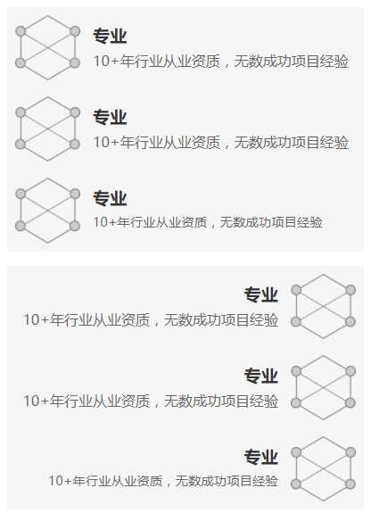

# ycbm

一个垂直样式列表组。每个子项包含：ICON、标题h1、副标题h2、文本text。

## CSS Class

* `.ycbm`  列表组。一般是用ul.ycbm
* `.ycbm.right`  右对齐模式的列表组，参见示例二。
* `.ycbm-item`  列表项
* `.ycbm-icon` 列表项的ICON
* `.ycbm-h1`  列表项的大标题
* `.ycbm-h2`  列表项的小标题
* `.ycbm-text`  列表项的普通文本

## 层次关系

```
ul.ycbm
    li.ycbm-item
        img.ycbm-icon
        .ycbm-h1
        .ycbm-h2
        .ycbm-text
```

## 示例

